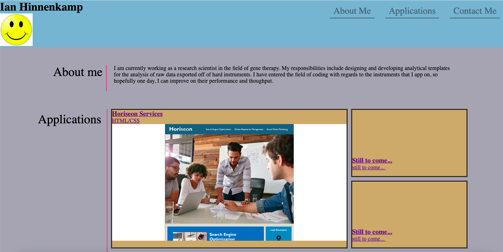
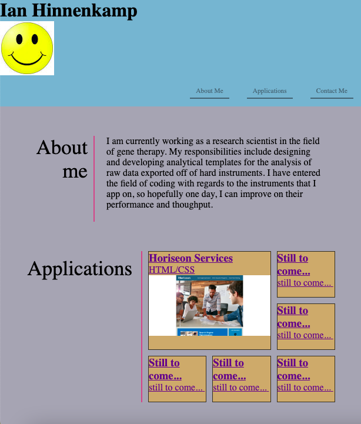

# module-2-challenge
HW Assignment for Week-2 Material

1. [ Description. ](#desc)
2. [ Web Address. ](#web-address)
3. [ Usage tips. ](#usage)

<a name="desc"></a>
## 1. Description

### This is the landing page for Ian Hinnenkamp's web portfolio.

Desktop screen:



Smaller devices screen example:



<a name="web-address"></a>
## 2. How to Get There

### Open your favorite web browser and enter the following web address to access.

```html

https://
```
<a name="usage"></a>
## 3. Usage Tips


### Use the top right navigation panel to visit the different sections of the web page.

Desktop screen:


